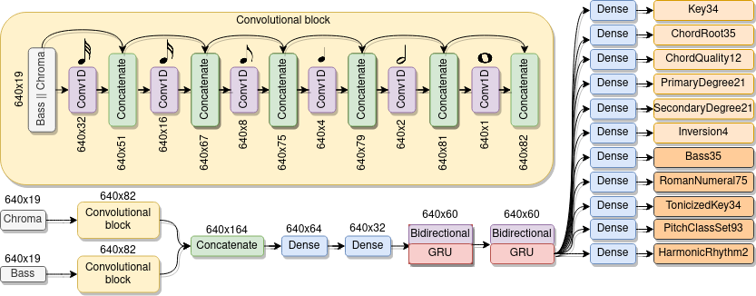
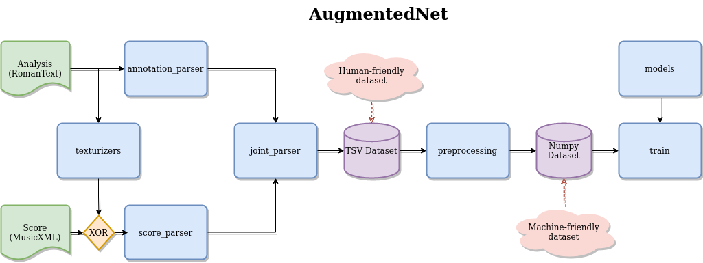

# AugmentedNet
A Roman Numeral Analysis Network with Synthetic Training Examples and Additional Tonal Tasks


## The neural network architecture

The architecture is a CRNN (Convolutional Recurrent Neural Network) with an alternative representation of pitch spelling at the input.

More information about the neural network architecture can be found in the paper.




## Organization of the repo

The code is organized in the following way
```
.
├── AugmentedNet
├── img
├── misc
├── notebooks
└── test
```

- [AugmentedNet](AugmentedNet) has all the source code of the network
- [img](img) the image diagrams of the network and code organization
- [misc](misc) useful, but non-essential, stand-alone scripts that I wrote while developing this project
- [notebooks](notebooks) Jupyter notebook *playgrounds* used throughout the project (e.g., data exploration)
- [test](test) unit tests for all relevant modules of the network

## The AugmentedNet source code

The general organization of the code is summarized by the following diagram.



Each of the blue rectangles roughly corresponds to a Python module.

The inputs of the network are pairs of (score, annotation) files.

The inputs pairs are transformed into pandas DataFrame objects, stored as `.tsv` files.

Later on, these are encoded in a representation that can be dispatched to the neural network.
